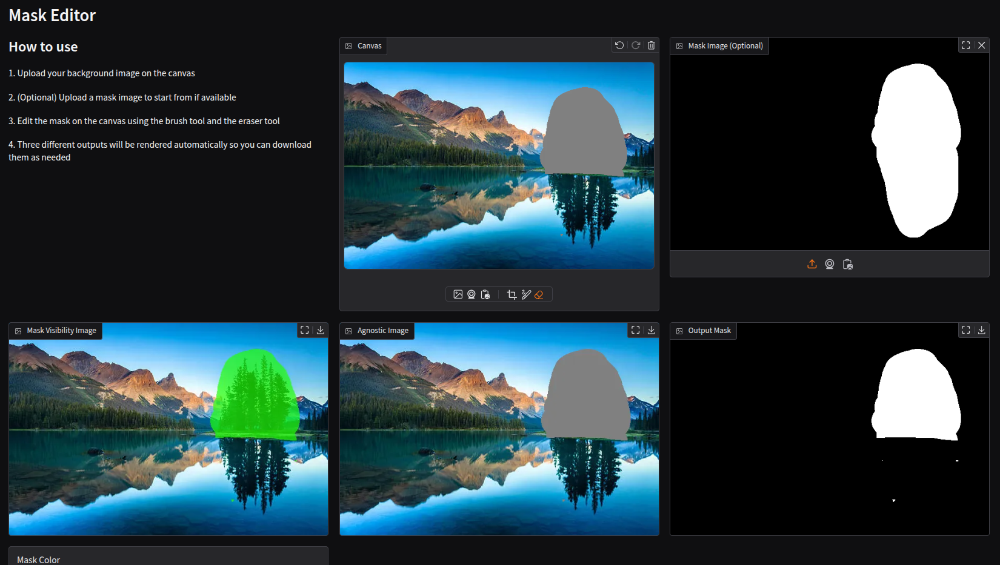

# Mask Editor

A simple yet powerful web application for creating and editing binary masks for images.
Check demo at https://huggingface.co/spaces/drodriguezciotti/mask_editor




## Overview

This application allows users to create, edit, and visualize binary masks for images. It provides an intuitive interface for drawing masks on top of images and offers multiple visualization options.

## Features

- **Interactive Canvas**: Draw masks directly on your images using brush and eraser tools
- **Mask Import**: Upload existing mask images to continue editing
- **Multiple Visualization Modes**:
  - **Colored Overlay**: View your mask as a customizable colored transparent overlay
  - **Agnostic View**: See your mask as a standard gray overlay
  - **Binary Mask**: Export a pure black and white mask image
- **Custom Color Selection**: Choose any color for the mask visualization

## How to Use

1. Upload your background image on the canvas
2. (Optional) Upload a mask image to start from if available
3. Edit the mask on the canvas using the brush tool and the eraser tool
4. Three different outputs will be rendered automatically so you can download them as needed

## Installation to run app locally

1. Clone this repository
2. This repository use UV as package manager([UV Installation Guide](https://docs.astral.sh/uv/getting-started/installation/))
3. Install the required dependenciesand run the app
   ```
    uv sync
    uv run python main.py
   ```
4. Open your browser and navigate to the URL displayed in the terminal (typically http://127.0.0.1:7860)

